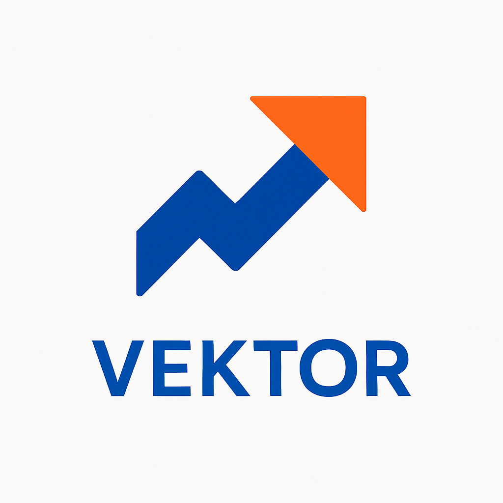
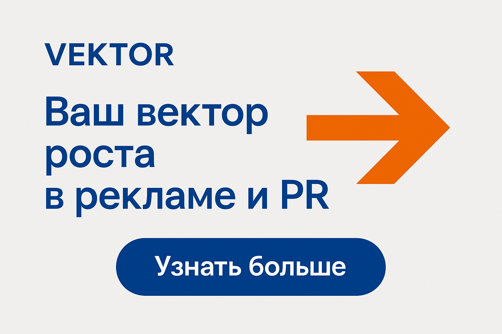
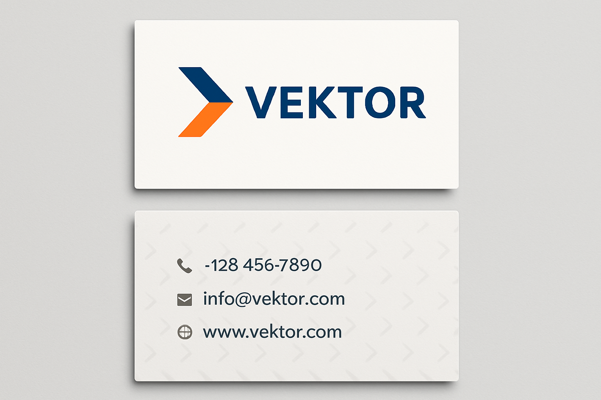

# Проект: Расширенный Фирменный Стиль и Рекламное Оформление для Рекламного Агентства «ВЕКТОР» (V3.0)

## Обзор Проекта

Данный проект представляет собой **расширенную и улучшенную** разработку фирменного стиля и рекламного оформления для рекламного агентства **«ВЕКТОР»**.

В этой версии:
1.  **Расширена** документация Brand Book (добавлены правила использования логотипа и фирменный паттерн).
2.  **Добавлены** новые визуальные активы (мокап визитной карточки).
3.  **Исправлен** синтаксис Markdown для корректного отображения изображений на GitHub.

### Ключевые Элементы Бренда

| Элемент | Описание |
| :--- | :--- |
| **Название** | **«ВЕКТОР»** |
| **Слоган** | «Ваш вектор роста в рекламе и PR» |
| **Ключевая Ценность** | Клиентоориентированность и Прозрачность |

## Содержание Репозитория

| Файл | Описание |
| :--- | :--- |
| `creative_concept.md` | Разработка названия, слогана, легенды бренда и ключевых ценностей. |
| `visual_identity.md` | Детальное описание концепции логотипа, цветовой палитры и типографики, включая правила использования логотипа и фирменный паттерн. |
| `brand_book_outline.md` | Расширенная структура Brand Book с разделами по фирменным носителям. |
| `advertising_brief.md` | Расширенный рекламный бриф для кампании «ВЕКТОР: Направление на Рост» с KPI. |
| `logo_vektor.png` | **Визуализация логотипа** агентства «ВЕКТОР». |
| `ad_banner_mockup.png` | **Мокап рекламного баннера** в фирменном стиле. |
| `business_card_mockup.png` | **Мокап визитной карточки** в фирменном стиле. |

---

## Визуальные Активы

### 1. Логотип «ВЕКТОР»

### 2. Мокап Рекламного Оформления

### 3. Мокап Фирменного Носителя

